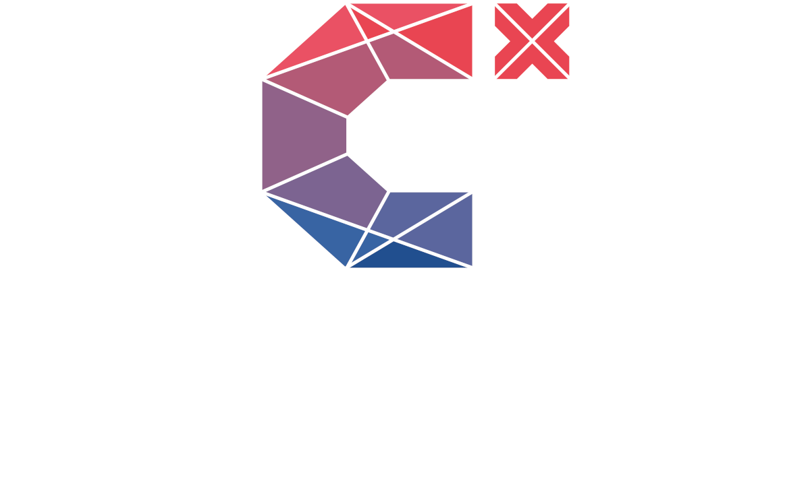

```{r setup, include=FALSE}
knitr::opts_chunk$set(echo = TRUE)
```

```{r echo=FALSE}
particlesjs::particles(config = "particlesjs-config-localchapter.json")
```

# {.flexbox .vcenter .larger}
<div class="centered"></div>
<br>
<div class="koeln">Cologne</div>
<p></p>
<br><br><br><br>

# {.flexbox .vcenter .larger}
<div class="centered"></div>
<br>
<div class="koeln">Cologne</div>
<br><br>
<p style="color: #ffffff;">Meetings: Every 2nd Monday, 19:00 @ Slack-Channel <b style="color: #2c73dd">#lc-koeln</b></p>
<p style="color: #ffffff;">Next Meeting: <b style="color: #2c73dd;">November 16th</b></p>
<div class="centered"><b style="color: #2c73dd;">koeln@correlaid.org</b></div>
